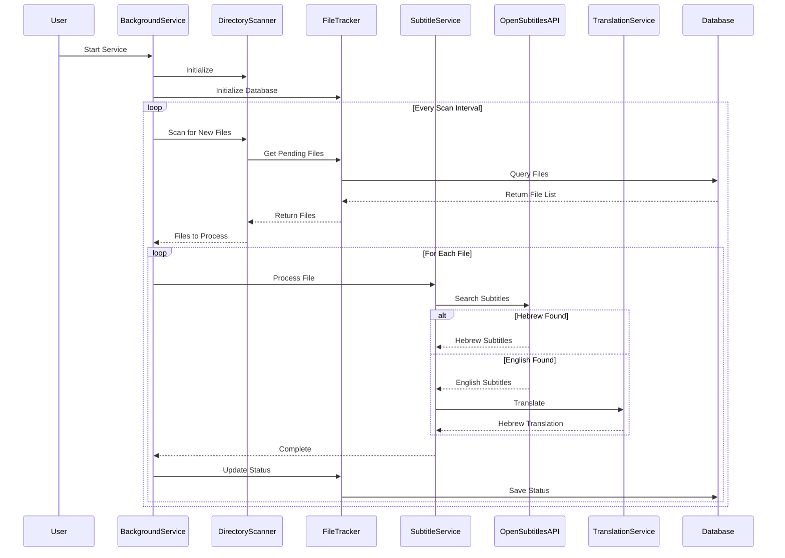
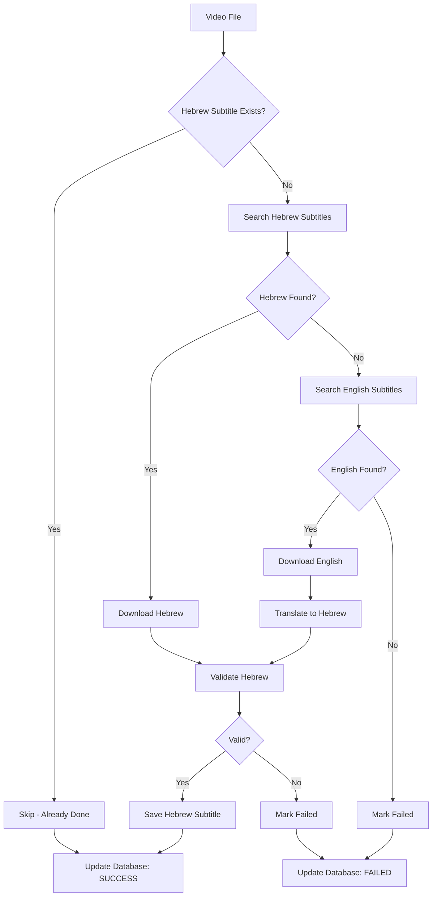

# Clean Architecture Overview

## Project Cleanup Summary

After analyzing the entire project, we identified and removed unused files to create a cleaner, more maintainable codebase.

### Files Removed/Moved

#### ❌ **Completely Removed**
- `src/background_service/` - Entire refactored directory (16 files) that was not being used
  - The main service uses `src/services/background_service.py` instead

#### 📁 **Moved to Tests**
- `src/services/*.test.py` → `tests/unit/` - Unit test files
- `src/services/health_monitor.py` → `tests/scripts/` - Unused health monitoring
- `src/services/simple_health_monitor.py` → `tests/scripts/` - Unused simple health monitoring  
- `src/services/service_logger.py` → `tests/scripts/` - Unused service logging
- `src/security/` → `tests/scripts/security/` - Security modules not used in main flow

### Current Clean Architecture

```mermaid
graph TB
    %% Entry Points
    subgraph "Entry Points"
        A[run_background_service.py]
        B[src/main.py]
        C[scripts/translate_subtitles.py]
    end

    %% Core Services
    subgraph "Core Services"
        D[BackgroundService]
        E[SubtitleService]
        F[DirectoryScanner]
        G[FileTracker]
        H[NotificationService]
        I[ServiceCommunicationManager]
    end

    %% API & Processing
    subgraph "API & Processing"
        J[OpenSubtitlesAPI]
        K[TranslationService]
        L[SubtitleValidationService]
    end

    %% Configuration & Logging
    subgraph "Configuration & Logging"
        M[ConfigManager]
        N[SubtitleLogger]
    end

    %% Data Storage
    subgraph "Data Storage"
        O[(SQLite Database)]
        P[config.yaml]
        Q[.env file]
    end

    %% External APIs
    subgraph "External APIs"
        R[OpenSubtitles XML-RPC]
        S[OpenAI API]
    end

    %% File System
    subgraph "File System"
        T[Monitored Directories]
        U[Video Files]
        V[Subtitle Files]
    end

    %% Connections
    A --> D
    B --> E
    C --> E
    
    D --> F
    D --> G
    D --> H
    D --> I
    
    E --> J
    E --> K
    E --> L
    
    F --> T
    F --> U
    G --> O
    
    J --> R
    K --> S
    
    E --> V
    K --> V
    
    M --> P
    M --> Q
    M --> D
    M --> E
    
    N --> D
    N --> E
    N --> F
    N --> G

    %% Styling
    classDef entryPoint fill:#e1f5fe,stroke:#01579b,stroke-width:2px
    classDef coreService fill:#f3e5f5,stroke:#4a148c,stroke-width:2px
    classDef api fill:#e8f5e8,stroke:#1b5e20,stroke-width:2px
    classDef config fill:#fff3e0,stroke:#e65100,stroke-width:2px
    classDef storage fill:#fce4ec,stroke:#880e4f,stroke-width:2px
    classDef external fill:#ffebee,stroke:#b71c1c,stroke-width:2px
    classDef filesystem fill:#f1f8e9,stroke:#33691e,stroke-width:2px

    class A,B,C entryPoint
    class D,E,F,G,H,I coreService
    class J,K,L api
    class M,N config
    class O,P,Q storage
    class R,S external
    class T,U,V filesystem
```



## Simplified Component Flow

### 1. Background Service Flow (Main Use Case)



### 2. File Processing Decision Tree



## Current Active Components

### ✅ **Core Active Services** (9 files)
1. **`background_service.py`** - Main orchestrator
2. **`subtitle_service.py`** - Core subtitle processing
3. **`directory_scanner.py`** - Directory monitoring
4. **`file_tracker.py`** - Database management
5. **`notification_service.py`** - System notifications
6. **`service_communication.py`** - Inter-service communication
7. **`translation.py`** - OpenAI translation
8. **`validation.py`** - Subtitle validation
9. **`opensubtitles.py`** - OpenSubtitles API client

### ✅ **Supporting Components** (4 files)
1. **`config_manager.py`** - Configuration management
2. **`subtitle_logger.py`** - Structured logging
3. **`file_utils.py`** - File utilities
4. **`subtitle_exceptions.py`** - Custom exceptions

### ✅ **Entry Points** (3 files)
1. **`run_background_service.py`** - Main service runner
2. **`src/main.py`** - CLI interface
3. **`scripts/translate_subtitles.py`** - Standalone translator

### ✅ **Configuration Files** (3 files)
1. **`config/config.yaml`** - Main configuration
2. **`.env`** - Environment variables
3. **`requirements.txt`** - Dependencies

## Benefits of Cleanup

### 🎯 **Reduced Complexity**
- **Before**: 40+ Python files with unclear relationships
- **After**: 16 core files with clear responsibilities

### 📁 **Better Organization**
- **Tests**: Properly organized in `tests/unit/` and `tests/scripts/`
- **Scripts**: Utility scripts in `scripts/`
- **Documentation**: Comprehensive docs in `docs/`

### 🔧 **Easier Maintenance**
- **Clear Dependencies**: Each component has well-defined responsibilities
- **Reduced Confusion**: No duplicate or unused code
- **Better Testing**: Tests organized by type and purpose

### 🚀 **Improved Performance**
- **Faster Startup**: No unused imports or modules
- **Cleaner Memory**: No unused objects in memory
- **Better Debugging**: Clearer code paths and relationships

## Key Design Principles

### 1. **Single Responsibility**
Each service has one clear purpose:
- `BackgroundService` - Orchestration
- `SubtitleService` - Subtitle processing
- `FileTracker` - Database management
- `DirectoryScanner` - File discovery

### 2. **Dependency Injection**
Services receive their dependencies through constructor injection:
```python
service = BackgroundService(config_manager)
```

### 3. **Configuration-Driven**
All behavior is configurable through `config.yaml` and environment variables.

### 4. **Error Handling**
Comprehensive error handling with retry logic and graceful degradation.

### 5. **Observability**
Structured logging and health monitoring throughout the system.

## Future Enhancements

The clean architecture makes it easy to add new features:

1. **Enhanced Database Schema** - Multi-directory support
2. **GUI Interface** - Web-based dashboard
3. **Cloud Integration** - Support for cloud storage
4. **Machine Learning** - Automated quality improvement
5. **Multi-language Support** - Beyond Hebrew

The current architecture provides a solid foundation for these enhancements while maintaining clean separation of concerns and easy testing. 