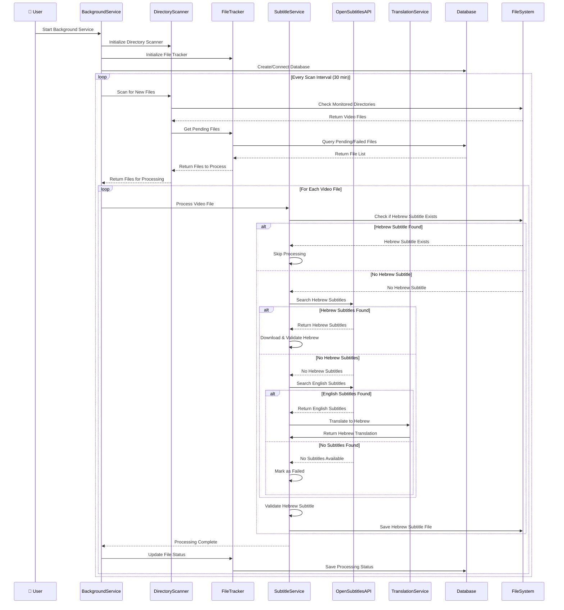
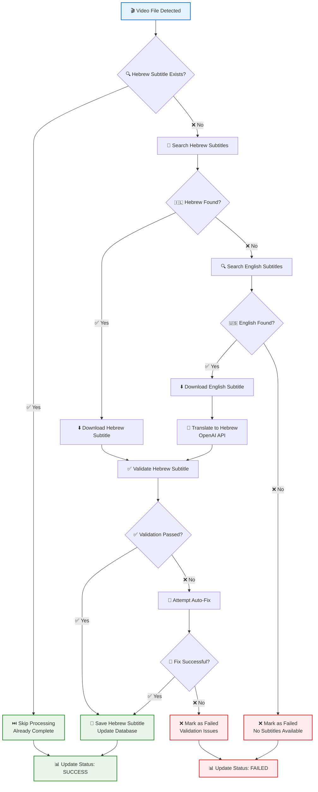
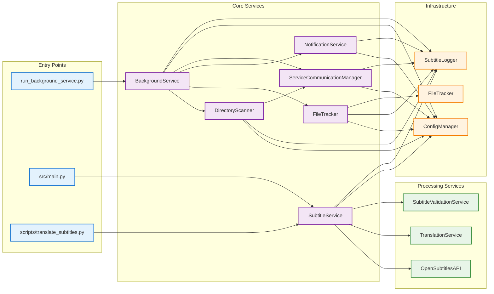
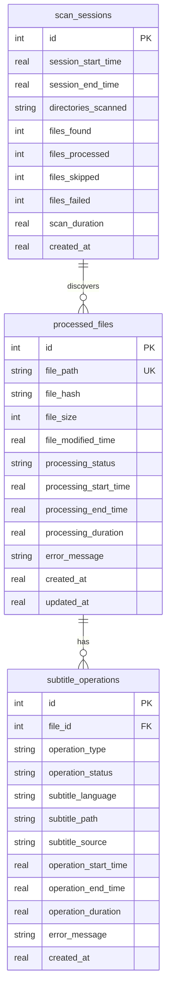

# Mermaid Architecture Diagram

## System Architecture for Grab Subtitle Service

This diagram shows the complete system architecture and data flow of the Grab Subtitle service.

```mermaid
graph TB
    %% User Interface Layer
    subgraph UI ["🎯 User Interface Layer"]
        A[run_background_service.py<br/>Main Service Runner]
        B[src/main.py<br/>CLI Interface]
        C[scripts/translate_subtitles.py<br/>Standalone Translator]
    end

    %% Core Service Layer
    subgraph Core ["⚙️ Core Service Layer"]
        D[BackgroundService<br/>Main Orchestrator]
        E[SubtitleService<br/>Subtitle Processing]
        F[DirectoryScanner<br/>File Discovery]
        G[FileTracker<br/>Database Manager]
        H[NotificationService<br/>System Notifications]
        I[ServiceCommunicationManager<br/>Inter-Service Communication]
    end

    %% Processing Layer
    subgraph Processing ["🔄 Processing Layer"]
        J[OpenSubtitlesAPI<br/>Subtitle Search & Download]
        K[TranslationService<br/>OpenAI Translation]
        L[SubtitleValidationService<br/>Quality Validation]
    end

    %% Infrastructure Layer
    subgraph Infrastructure ["🏗️ Infrastructure Layer"]
        M[ConfigManager<br/>Configuration Management]
        N[SubtitleLogger<br/>Structured Logging]
        O[(SQLite Database<br/>File Tracking & History)]
        P[config.yaml<br/>Service Configuration]
        Q[.env<br/>Environment Variables]
    end

    %% External Systems
    subgraph External ["🌐 External Systems"]
        R[OpenSubtitles XML-RPC API<br/>Subtitle Database]
        S[OpenAI API<br/>Translation Engine]
    end

    %% File System
    subgraph FileSystem ["💾 File System"]
        T[Monitored Directories<br/>Video File Storage]
        U[Video Files<br/>.mp4, .mkv, .avi, etc.]
        V[Subtitle Files<br/>.heb.srt, .eng.srt]
    end

    %% Data Flow Connections
    %% UI to Core
    A --> D
    B --> E
    C --> E

    %% Core Service Dependencies
    D --> F
    D --> G
    D --> H
    D --> I

    %% Processing Dependencies
    E --> J
    E --> K
    E --> L

    %% Infrastructure Dependencies
    D --> M
    D --> N
    E --> M
    E --> N
    F --> M
    F --> N
    G --> M
    G --> N

    %% Database Connections
    G --> O

    %% Configuration
    M --> P
    M --> Q

    %% External API Connections
    J --> R
    K --> S

    %% File System Connections
    F --> T
    F --> U
    E --> V
    K --> V

    %% Styling
    classDef uiLayer fill:#e3f2fd,stroke:#1976d2,stroke-width:2px,color:#0d47a1
    classDef coreLayer fill:#f3e5f5,stroke:#7b1fa2,stroke-width:2px,color:#4a148c
    classDef processingLayer fill:#e8f5e8,stroke:#388e3c,stroke-width:2px,color:#1b5e20
    classDef infrastructureLayer fill:#fff3e0,stroke:#f57c00,stroke-width:2px,color:#e65100
    classDef externalLayer fill:#ffebee,stroke:#d32f2f,stroke-width:2px,color:#b71c1c
    classDef fileSystemLayer fill:#f1f8e9,stroke:#689f38,stroke-width:2px,color:#33691e

    class A,B,C uiLayer
    class D,E,F,G,H,I coreLayer
    class J,K,L processingLayer
    class M,N,O,P,Q infrastructureLayer
    class R,S externalLayer
    class T,U,V fileSystemLayer
```

## Data Flow Sequence Diagram

## File Processing Decision Flow

## Component Dependencies

## Database Schema

## Usage Instructions

1. **Copy the Mermaid code** from any of the diagrams above
2. **Paste into MermaidChart** (https://www.mermaidchart.com/)
3. **Customize styling** as needed
4. **Export** as PNG, SVG, or PDF

## Diagram Features

- **Color-coded layers** for easy understanding
- **Clear component relationships** with proper arrows
- **Professional styling** suitable for documentation
- **Comprehensive coverage** of all system components
- **Multiple perspectives** (architecture, flow, dependencies, database) 