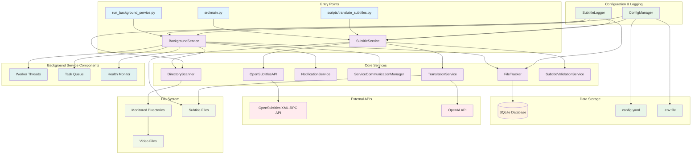
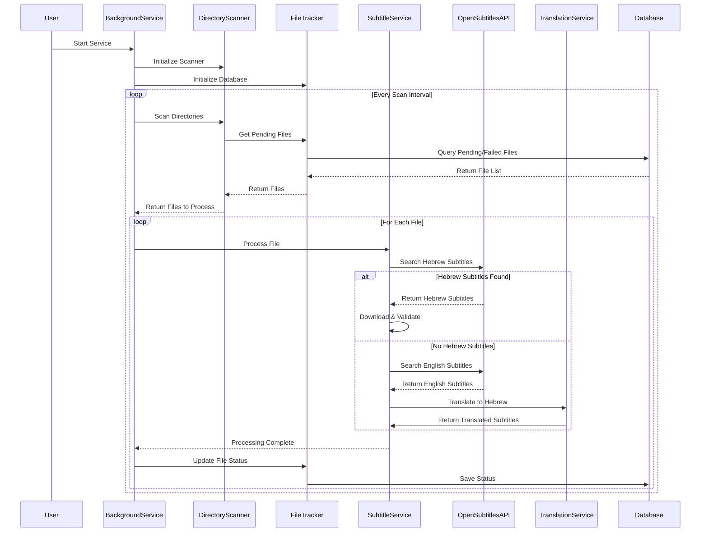
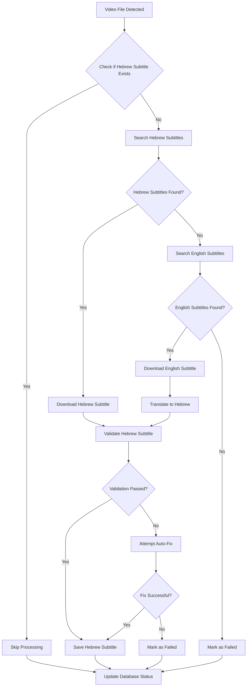

# System Architecture

## Overview

This document describes the system architecture of the Grab Subtitle service, showing how all components interact and work together.

## System Architecture Diagram



## Component Interaction Flow

### 1. Background Service Flow



### 2. File Processing Flow



## Component Details

### 1. Entry Points

#### `run_background_service.py`
- **Purpose**: Main entry point for the background service
- **Functionality**: 
  - Loads environment variables
  - Initializes configuration
  - Starts background service
  - Handles graceful shutdown
- **Dependencies**: BackgroundService, ConfigManager, NotificationService

#### `src/main.py`
- **Purpose**: Command-line interface for standalone processing
- **Functionality**:
  - Processes single files or directories
  - Handles validation-only mode
  - Provides command-line arguments
- **Dependencies**: SubtitleService

#### `scripts/translate_subtitles.py`
- **Purpose**: Standalone translation utility
- **Functionality**: Translates existing subtitle files
- **Dependencies**: TranslationService

### 2. Core Services

#### BackgroundService (`src/services/background_service.py`)
- **Purpose**: Main orchestrator for the background service
- **Key Responsibilities**:
  - Directory monitoring and scanning
  - Worker thread management
  - Task queue management
  - Service lifecycle management
  - Status reporting and health monitoring
- **State Management**: ServiceState (STOPPED, STARTING, RUNNING, STOPPING, ERROR, PAUSED)
- **Dependencies**: DirectoryScanner, FileTracker, SubtitleService, NotificationService

#### SubtitleService (`src/services/subtitle_service.py`)
- **Purpose**: Core subtitle processing logic
- **Key Responsibilities**:
  - Subtitle search and download
  - Translation coordination
  - Validation integration
  - File management
- **Dependencies**: OpenSubtitlesAPI, TranslationService, SubtitleValidationService

#### DirectoryScanner (`src/services/directory_scanner.py`)
- **Purpose**: Monitors directories for new video files
- **Key Responsibilities**:
  - Recursive directory scanning
  - Video file detection
  - Change detection
  - Progress reporting
- **Dependencies**: FileTracker, ServiceCommunicationManager

#### FileTracker (`src/services/file_tracker.py`)
- **Purpose**: Database management for file tracking
- **Key Responsibilities**:
  - File status tracking
  - Processing history
  - Database operations
  - Statistics collection
- **Database Tables**: processed_files, subtitle_operations, scan_sessions

### 3. API Integrations

#### OpenSubtitlesAPI (`src/api/opensubtitles.py`)
- **Purpose**: OpenSubtitles API client
- **Key Features**:
  - XML-RPC API integration
  - Hash-based subtitle search
  - Query-based subtitle search
  - Retry logic for API errors
  - Authentication management
- **API Endpoint**: https://vip-api.opensubtitles.org/xml-rpc

#### TranslationService (`src/services/translation.py`)
- **Purpose**: OpenAI-based subtitle translation
- **Key Features**:
  - OpenAI API integration
  - Subtitle chunking
  - Translation processing
  - Quality control
  - Error handling
- **Dependencies**: OpenAI API

### 4. Configuration & Logging

#### ConfigManager (`src/config/config_manager.py`)
- **Purpose**: Configuration management
- **Key Features**:
  - YAML configuration loading
  - Environment variable substitution
  - Configuration validation
  - Default value management
- **Configuration File**: config/config.yaml

#### SubtitleLogger (`src/logging_system/subtitle_logger.py`)
- **Purpose**: Structured logging system
- **Key Features**:
  - JSON-formatted logs
  - Context-aware logging
  - Log rotation
  - Multiple log levels
- **Log Directory**: logs/

### 5. Validation & Quality

#### SubtitleValidationService (`src/services/validation.py`)
- **Purpose**: Hebrew subtitle validation
- **Key Features**:
  - Hebrew text detection
  - SRT format validation
  - Encoding validation
  - Content quality checks
  - Automatic fixes
- **Validation Criteria**:
  - Hebrew content ratio (≥50%)
  - Proper SRT format
  - Valid timestamps
  - UTF-8 encoding

### 6. Data Flow

#### Database Schema
```sql
-- Main tables for file tracking
processed_files (
    id, file_path, file_hash, file_size, file_modified_time,
    processing_status, processing_start_time, processing_end_time,
    processing_duration, error_message, created_at, updated_at
)

subtitle_operations (
    id, file_id, operation_type, operation_status,
    subtitle_language, subtitle_path, subtitle_source,
    operation_start_time, operation_end_time, operation_duration,
    error_message, created_at
)

scan_sessions (
    id, session_start_time, session_end_time, directories_scanned,
    files_found, files_processed, files_skipped, files_failed,
    scan_duration, created_at
)
```

#### File Processing States
1. **PENDING**: File discovered, waiting for processing
2. **PROCESSING**: File currently being processed
3. **SUCCESS**: File processed successfully
4. **FAILED**: File processing failed (will be retried)
5. **SKIPPED**: File skipped (e.g., subtitle already exists)

## Error Handling & Recovery

### 1. API Error Handling
- **OpenSubtitles API**: Retry logic for "Idle" responses
- **OpenAI API**: Exponential backoff for rate limits
- **Network Errors**: Automatic retry with delays

### 2. File Processing Recovery
- **Failed Files**: Automatically retried in next scan
- **Database Errors**: Graceful error handling and logging
- **Validation Errors**: Automatic fix attempts

### 3. Service Recovery
- **Graceful Shutdown**: Signal handling for clean shutdown
- **State Persistence**: Database maintains processing state
- **Health Monitoring**: Service health tracking and reporting

## Performance Considerations

### 1. Parallel Processing
- **Worker Threads**: Configurable number of worker threads
- **Task Queue**: Priority-based task processing
- **Database Connections**: Connection pooling for database operations

### 2. Resource Management
- **Memory Usage**: Efficient file processing without loading entire files
- **Disk I/O**: Optimized file operations and database queries
- **Network Usage**: Efficient API calls with caching where possible

### 3. Scalability
- **Multiple Directories**: Support for monitoring multiple directories
- **Configurable Intervals**: Adjustable scan frequencies
- **Database Optimization**: Indexed queries for performance

## Security Considerations

### 1. API Security
- **Credential Management**: Secure storage of API keys
- **Network Security**: HTTPS for all API communications
- **Rate Limiting**: Respectful API usage with retry logic

### 2. File System Security
- **Path Validation**: Secure path handling and validation
- **Permission Checks**: Proper file permission handling
- **Error Handling**: Secure error messages without information leakage

## Monitoring & Observability

### 1. Logging
- **Structured Logs**: JSON-formatted logs for easy parsing
- **Log Levels**: Configurable log levels (DEBUG, INFO, WARNING, ERROR)
- **Context Information**: Rich context in log messages

### 2. Health Monitoring
- **Service Health**: Real-time service health tracking
- **Performance Metrics**: Processing statistics and performance data
- **Error Tracking**: Comprehensive error logging and tracking

### 3. Status Reporting
- **Real-time Status**: Live status updates during operation
- **Statistics**: Processing statistics and performance metrics
- **Notifications**: System notifications for important events 